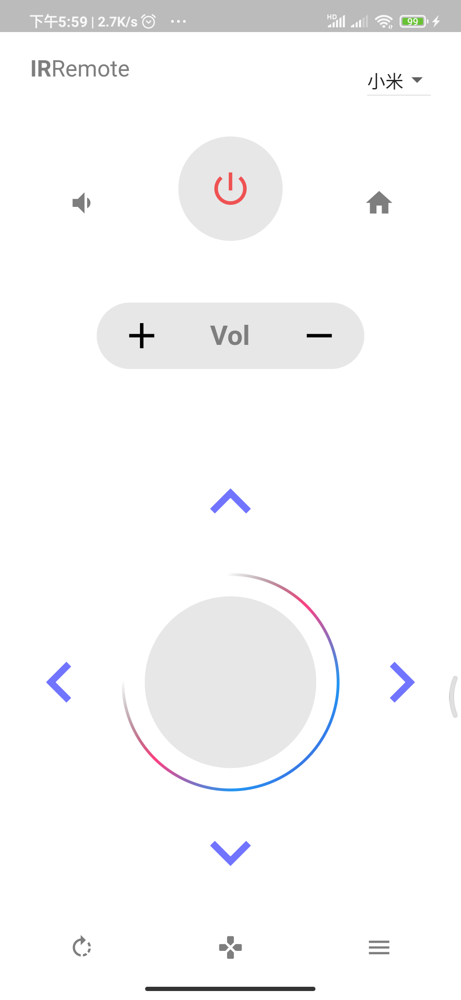

# flutter_ir_remote

A Flutter application which allows you control Tv/Box By IR.

## Getting Started

- install dependencies by
```
flutter pug get
```

- run project by
```
flutter run
```

### Supported Device
- Xiaomi TV/Box (小米电视/盒子)
- Tmall Box(天猫魔盒)
- Hisense TV(海信电视)
- Skyworth TV(创维酷开电视)




This project is a starting point for a Flutter application.

A few resources to get you started if this is your first Flutter project:

- [Lab: Write your first Flutter app](https://flutter.dev/docs/get-started/codelab)
- [Cookbook: Useful Flutter samples](https://flutter.dev/docs/cookbook)

For help getting started with Flutter, view our
[online documentation](https://flutter.dev/docs), which offers tutorials,
samples, guidance on mobile development, and a full API reference.

